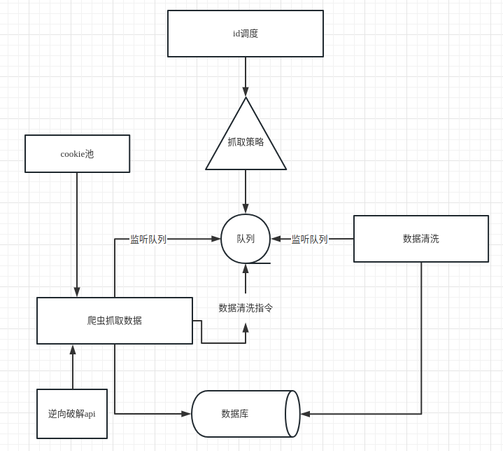

## crawler_spider
尝试着建立属于自己的系统架构，更新中

## 代码流程图



## 目录结构
```
.
├── dao              数据库
├── dockerfile       dockerfile 文件
├── docs             文档
├── extractors       解析
├── main.py          启动程序
├── node             js逆向
├── receivers        协程核心代码
├── README.md
├── settings_test.py 配置文件
├── spider           爬虫代码
├── sql              创建数据库表的语句
├── tool             工具类
└── web              web展示程序
└── api              开放接口
```

## 如何运行

1. 先创建数据库表：sql目录下有数据库表结构文件
2. 需要手动获取cookie信息，插入`daduoduo_dy_sign`sql表中
3. 运行

```PYTHON
python main_extrator_daduoduo.py  # 运行清洗数据
python main_spider_daduoduo.py  # 运行爬虫
python main_spider_test.py  # 轮询检测未被抓取的数据
```

## 工具代码
    tool/
        redis.conf 配置文件
        导出数据库表结构.py
        清空爬虫任务数据.py
        通过直播间id抓取任务.py

## docker日志

```powershell
    docker logs --tail="10" xxxxxxx
```

## docker 程序部署

```powershell
    docker build -t crawler_extrator -f /home/ayf/data/crawler_program/dockerfile/DockerfileExtrator .
    docker run -d --name=crawler_extrator --network=host --restart=always xxxxx

    docker build -t crawler_spider -f /home/ayf/data/crawler_program/dockerfile/DockerfileSpider .
    docker run -d --name=crawler_spider --network=host --restart=always xxxxx

    docker build -t crawler_monitor -f /home/ayf/data/crawler_program/dockerfile/DockerfileMonitor .
    docker run -d --name=crawler_monitor --network=host --restart=always xxxxx
```

## docker 数据库部署

```powershell
    线上
    docker run -p 6379:6379 --name redis -v /home/ayf/data/redis/redis.conf:/etc/redis/redis.conf  -v /home/ayf/data/redis/data:/data -d redis redis-server /etc/redis/redis.conf --appendonly yes
    本地
    docker run -p 6379:6379 --name redis -v /home/ayf/project/redis/redis.conf:/etc/redis/redis.conf  -v /home/ayf/project/redis/data:/data -d redis redis-server /etc/redis/redis.conf --appendonly yes
```

## 其他代码

查看数据库中各表数据

```sql
SELECT
    table_schema AS '数据库',
    table_name AS '表名',
    table_rows AS '记录数',
    TRUNCATE ( data_length / 1024 / 1024, 2 ) AS '数据容量(MB)',
    TRUNCATE ( index_length / 1024 / 1024, 2 ) AS '索引容量(MB)' 
FROM
    information_schema.TABLES 
WHERE
    table_schema = 'eb_supports_daduoduo' 
ORDER BY
    data_length DESC,
    index_length DESC;
```