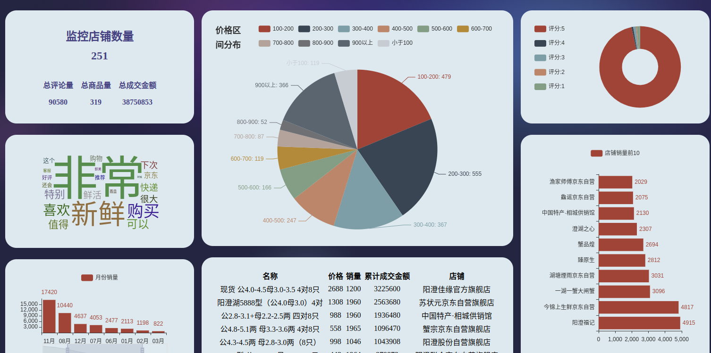

## crawler_suda
尝试着建立属于自己的系统架构，更新中

## 目录结构
.
├── dao              数据库
├── dockerfile       dockerfile 文件
├── docs             文档
├── extrator         解析
├── main.py          启动程序
├── node             js逆向
├── README.md
├── settings_test.py  配置文件
├── spider           爬虫代码
├── sql              创建数据库表的语句
├── tool             工具类
└── web              web展示程序

## 登陆效果图

## 数据大盘效果图
